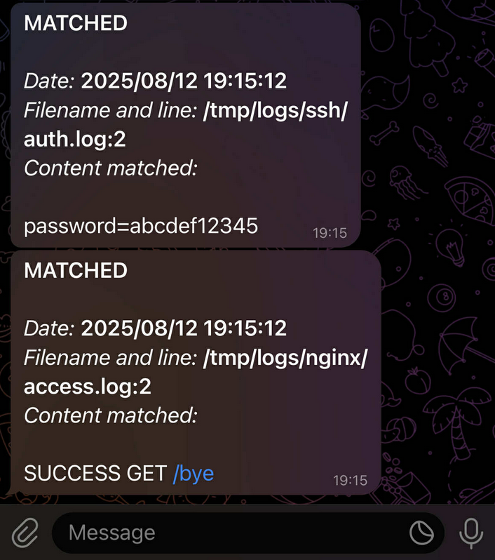

<p align="center">
    <picture>
        
    </picture>
    <br>
    <strong style="font-size: large;">dende-rs (デンデ, Dende)</strong>
</p>

<hr />

Like Dende in DBZ watches over Earth, `dende-rs` watches over your log files in real time and alerts the right people as soon as something happens. A fast Rust observer that monitors your log files and sends alerts when a line matches a string or regular expression. Send notifications to the console and/or Telegram, via CLI flags or a multi-job with YAML configuration file.

- [HELP.md](HELP.md) - How to compile it? How to install it? How to use it? How to add another API notifier?
- [CHANGELOG.md](CHANGELOG.md) - A record of all significant version changes
- [ROADMAP.md](ROADMAP.md) - List of planned evolutions

## Quick usage

1. Download [Rust](https://www.rust-lang.org/tools/install).
2. Create a new bot using [@Botfather](https://core.telegram.org/bots/tutorial#obtain-your-bot-token) to get a token in the format `0123456789:XXXXxXXxxxXxX3x3x-3X-XxxxX3XXXXxx3X`.
3. Put these token into YAML file or directly as CLI argument.
4. Obtain your Telegram UserId for user who would like to contact, by sending `/start` to [@userinfo](https://telegram.me/userinfobot).
5. Put these UserId YAML file like "tg:ID" or directly as CLI argument.
6. Please have each Telegram user send /start to your bot (bots can’t initiate DMs).
7. Make sure that your [Rust](https://www.rust-lang.org/tools/install) compiler is up to date:

```bash
$ rustup update nightly
$ rustup override set nightly
```

8. Compilation:

```bash
cargo build --release
```

9. Usage:

```bash
# YAML multi-job mode
target/release/dende-rs --config ./config_example.yaml

# Single-job CLI from string search
target/release/dende-rs -- \
  -P /var/log/myapp \
  -S ERROR \
  -T console -T tg:123456789 \
  --recursive

# Single-job CLI from regex search
target/release/dende-rs -P /var/log/myapp/access.log -R "^SUCCESS.*" -T tg:123456789
```

<hr />

<p align="center">
    <picture>
        
    </picture>
    <br>
</p>

<hr />